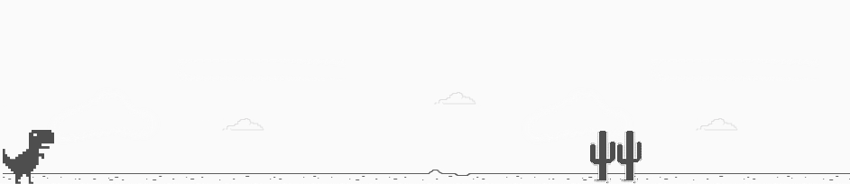

# Recriando o famoso jogo do dinossauro sem internet

Projeto desenvolvido utilizando JavaScript, CSS e HTML, no curso da plataforma Digital Inovation One.

**Personalização**

Neste projeto fiz algumas modificações em relação ao projeto original:
* Centralização da mensagem "Fim de Jogo" na tela;
* Adição de uma imagem que aparece logo abaixo da mensagem "Fim de jogo", que quando clicada atualiza a página reiniciando o jogo.